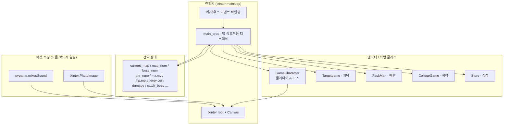
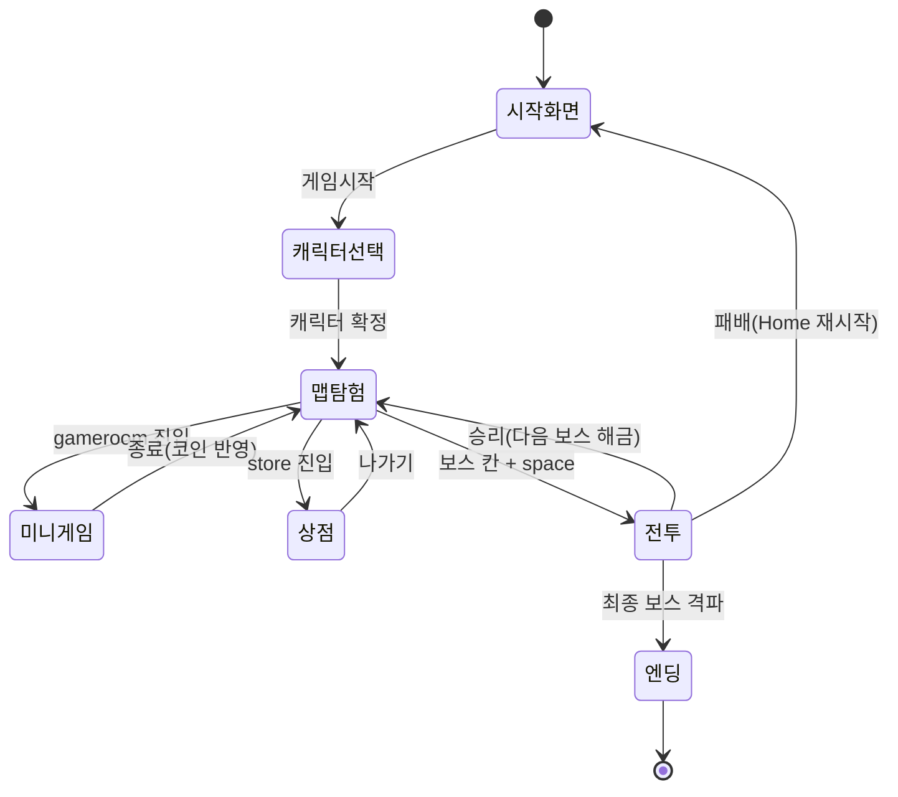

# 시스템 아키텍처 (System Architecture)

> 본 문서는 실제 소스(`Kangnam_University.py`)를 근거로 작성되었다.

## 개요

게임 전체가 **단일 Python 모듈**(약 2,100줄)로 구성된다. 외부 게임 엔진 없이 표준 `tkinter`
캔버스로 렌더링하고, `pygame.mixer`로 오디오를 재생한다. 상태는 모듈 최상단의 **전역 변수**로
관리되며, 게임 흐름은 일련의 함수로, 엔티티/화면은 클래스로 표현된다.

## 모듈 구성

| 영역 | 구성 요소 |
|---|---|
| 전역 상태 | `current_map`, `map_num`, `boss_num`, `chr_num`, `mx/my`, `hp/mp/energy/coin`, `damage`, `catch_boss`, `esc_try`, `story_index` 등 |
| 엔티티/화면 클래스 | `GameCharacter`, `Targetgame`, `PackMan`, `CollegeGame`, `Store` |
| 게임 흐름 함수 | `main_proc`, 이동(`move`/`draw_map`), 전투(`scratch`/`bite`/`skill_atk`/`escape`), 아이템(`heal`/`stamina`/`power_up`/`get_item`/`chest`), 대화(`before_war`/`win_war`/`lose_war`/`after_war`), 결과(`check_game_result`) |
| 입력 핸들러 | `key_press`, `key_up`, `mouse_move`, `mouse_click`, `mouse_release` |
| 오디오 | `play_bgm`, `play_atk` (채널: `bgm_channel`, `atk_channel`) |
| 부트스트랩 | 모듈 하단에서 root/canvas 생성 → 전 에셋 로드 → 캐릭터/보스 객체 생성 → `play_bgm` → `root.mainloop()` |

## 핵심 클래스

### `GameCharacter`

플레이어와 보스를 공통으로 표현하는 엔티티 클래스. 방향 플래그 `di`(플레이어=1 / 몬스터=-1)로
좌/우 진영을 구분한다.

- 상태: `name`, `lmax`(최대 HP), `life`(현재 HP), `power`/`lpower`, `gauge`, `imgfile`, `x/y`, `di`
- 화면: `draw_player`, `draw_boss`, `chat_draw`, `chat_remove`
- 전투: `attack_motion`, `player_damaged`, `boss_damaged`

### 미니게임 클래스 (`Targetgame` / `PackMan` / `CollegeGame`)

각 미니게임은 별도 `Toplevel` 창으로 실행되며 자체 캔버스/타이머/점수를 가진다. 종료 시
`close_toplevel`로 메인 게임으로 복귀하고, 획득 코인을 전역 `coin`에 반영한다.

### `Store`

"미역 상점" 창. 코인으로 HP/MP/에너지 아이템을 구매하며 전역 재화(`coin`, `hp`, `mp`, `energy`)를 갱신한다.

## 상태 흐름

## 렌더링 / 입력 모델

- **렌더링**: 모든 화면은 `Canvas`에 `create_image`/`create_text`/`create_rectangle`로 그린다.
  태그(`tag`)로 그룹을 묶어 `canvas.delete(tag)`로 갱신한다. 모션은 `canvas.coords` + `time.sleep` +
  `canvas.update`로 프레임을 수동 갱신한다.
- **입력**: `root.bind`로 키/마우스 이벤트를 핸들러에 연결. 맵 상태(`current_map`)에 따라
  `main_proc`가 분기하여 이동/상호작용/전투 진입을 처리한다.
- **오디오**: `pygame.mixer`의 두 채널로 BGM(루프)과 공격 SFX를 분리 재생한다.

## 설계 특성 및 한계

- **단일 파일 + 전역 상태**: 학기 프로젝트 특성상 모듈화·캡슐화보다 빠른 구현에 최적화됨.
  전역 변수 의존도가 높아 함수 간 결합도가 큼.
- **수동 프레임 루프**: `time.sleep` 기반 애니메이션이라 모션 중에는 입력이 블로킹됨.
- **상대 경로 미사용**: 에셋을 파일명만으로 로드하므로 실행 디렉토리에 에셋이 있어야 함
  ([시작 가이드](../03-guides/GETTING_STARTED.md) 참고).

> 위 한계는 결함이 아니라 "기말고사 단일 모듈 게임"이라는 제약 안에서의 트레이드오프다.
> 회고는 [04-devlog/RETROSPECTIVE.md](../04-devlog/RETROSPECTIVE.md) 참고.
